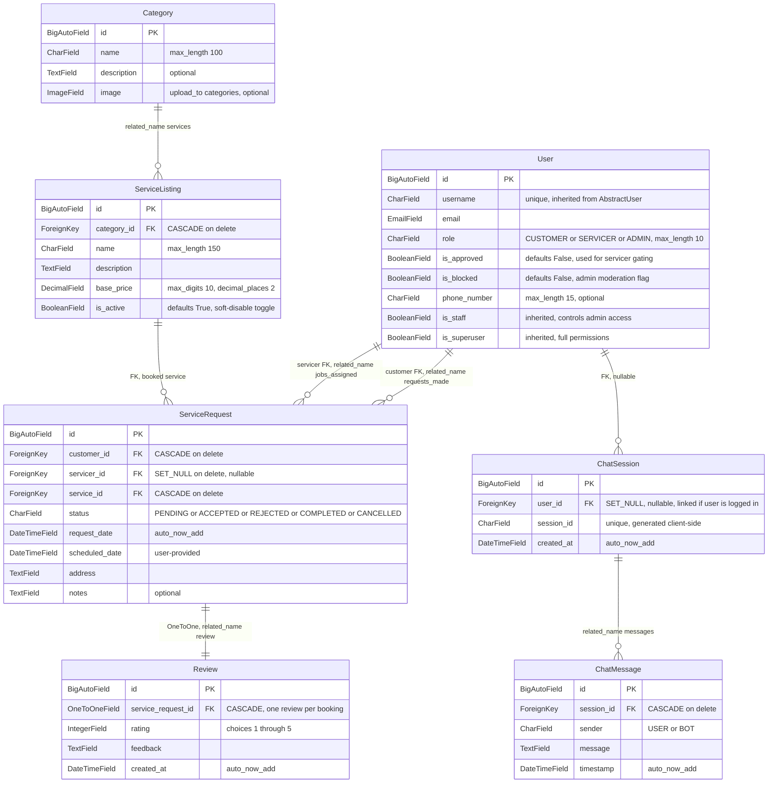
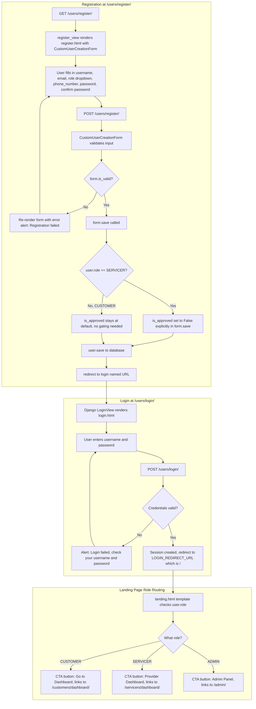
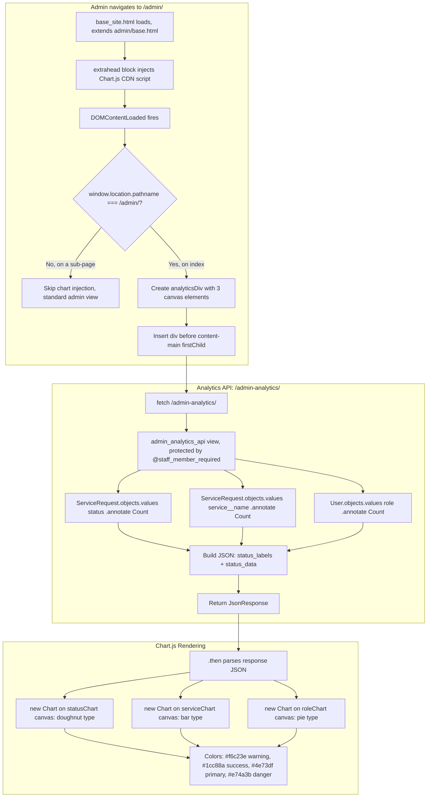
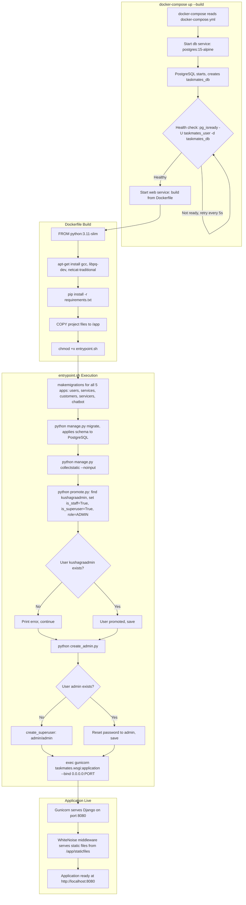

# CSE 3243 Web Programming Lab
## Mini Project Report

# TaskMates: On-Demand Home Services Booking Platform

---

**SUBMITTED BY**

| Name | Roll No | Registration No |
|------|---------|-----------------|
| ABC  | 23      | 200905200       |
| XYZ  | 24      | 200905202       |

**Section:** XX

**Under the Guidance of:**
XXXXXXXX and YYYYYYY

**School of Computer Engineering**
Manipal Institute of Technology, Manipal, Karnataka - 576104

**2025-26**

---

## Acknowledgement

We would like to sincerely thank our faculty guides for their continuous guidance and constructive feedback throughout the course of this project. Their insights on web architecture, database design, and deployment practices shaped many of our technical decisions. We are also grateful to the School of Computer Engineering, Manipal Institute of Technology, for providing us with the lab infrastructure that made development and testing possible. Finally, we appreciate the open-source community behind Django, Bootstrap, and the Google Gemini API, whose tools and documentation were indispensable during the build process.

---

## Abstract

TaskMates is a full-stack web application that connects customers who need home services (cleaning, repair, beauty treatments, etc.) with approved service providers through a managed booking workflow. The platform is built with Django 5.0 on the backend and uses Bootstrap 5 with server-side rendered Django templates on the frontend. It implements a role-based access system with three distinct user roles: Customer, Service Provider, and Administrator, each with their own dashboard and set of capabilities. A notable feature is a conversational AI chatbot powered by the Google Gemini 2.5 API, which assists users with service discovery, pricing inquiries, and booking guidance in real time. The application is containerized using Docker and Docker Compose with a PostgreSQL database, and is deployed to production using Gunicorn behind WhiteNoise for static file serving. This report covers the motivation, architecture, implementation details, and testing methodology of the project, and discusses potential avenues for future work.

---

## Table of Contents

1. Introduction
2. Literature Review / Related Work
3. Problem Statement
4. Proposed Work
5. Methodology and Technology Stack
6. System Architecture
7. Implementation Details
8. User Experience and Interface Design
9. Testing and Validation
10. Screenshots and Output
11. Results and Discussion
12. Future Work and Recommendations
13. Conclusion
14. References

---

## 1. Introduction

### 1.1 Background and Context

Finding reliable home service professionals, whether it is a plumber for a leaking faucet or someone for a deep house cleaning, is often a frustrating experience. For many people it involves calling around, comparing prices from memory, and hoping the person who shows up actually does a decent job. From the other side, skilled technicians and cleaners struggle to find a steady stream of clients and often rely on word-of-mouth referrals or local classifieds.

This project was motivated by the idea of bridging that gap through a simple web platform. We wanted to build something that lets a customer browse available services, book them with a couple of clicks, and track the status of their request, while also giving service providers a clear dashboard where they can pick up new jobs and manage their workload.

The Web Programming Lab (CSE 3243) gave us a good reason to attempt this. The lab curriculum covers the full stack from HTML/CSS and JavaScript on the frontend to Django and databases on the backend, so a project like this naturally ties together everything we learned over the semester. It also gave us a chance to go beyond the basics and work with things like containerized deployments, REST APIs, and third-party AI integrations, all of which are increasingly relevant in today's industry.

### 1.2 Research Objectives

Our primary goals for this project were straightforward:

1. Build a working marketplace platform where customers can book home services and providers can accept and fulfill those jobs.
2. Implement proper role-based access control, because a customer should not be able to accept jobs, and a provider should not be able to submit reviews on their own work.
3. Give administrators real visibility into platform activity through analytics dashboards, not just raw database tables.
4. Integrate a conversational AI assistant that can help users navigate services, compare prices, and understand how the platform works.
5. Package the application for reliable deployment using Docker and PostgreSQL, so it can actually run in production and not just on localhost.

### 1.3 Project Vision

TaskMates is designed to be more than a class exercise. It is a proof-of-concept for a viable local services marketplace that could, with additional features like payment processing and provider verification, serve a real community. The core idea is that the technology should get out of the way and let people find help quickly.

---

## 2. Literature Review / Related Work

### 2.1 Web Development Landscape

The modern web development ecosystem offers many choices. For server-rendered applications, Django remains one of the most popular frameworks thanks to its "batteries-included" philosophy. It ships with an ORM, an admin interface, authentication, session management, and CSRF protection out of the box. For projects that need a working prototype quickly, this is a significant advantage over more minimal frameworks like Flask or Express.js where each of those features requires separate library choices.

On the frontend, Bootstrap 5 continues to be widely used for building responsive interfaces without writing extensive custom CSS. While JavaScript-heavy SPA frameworks (React, Vue, Angular) dominate the frontend landscape for complex interactive applications, Django's template engine combined with Bootstrap provides a practical and fast-to-develop alternative for applications where most interactions are server-driven.

The emergence of large language model APIs, specifically Google's Gemini API, has opened up new possibilities for embedding intelligent assistants directly into web applications. Unlike traditional rule-based chatbots that require exhaustive decision trees, LLM-powered bots can handle free-form user queries and respond contextually, which is exactly what we leveraged for our chatbot feature.

### 2.2 Related Works and Comparative Analysis

Platforms like UrbanClap (now Urban Company) and TaskRabbit have established the on-demand home services model at scale. These platforms validate the core concept but are commercial products with massive engineering teams. For academic purposes, we studied their user flows, particularly how they handle role separation, job lifecycle management, and service catalogs, and implemented a simplified but functionally complete version of those workflows.

Key gaps in existing academic projects that we noticed include:

- Most student projects stop at CRUD operations and do not implement status-driven workflows (PENDING to ACCEPTED to COMPLETED).
- Very few integrate AI-based user assistance.
- Deployment is usually an afterthought. We addressed this head-on with Docker and docker-compose.

---

## 3. Problem Statement

Design and develop a full-stack web application that serves as an on-demand home services marketplace. The platform must:

1. Support three user roles (Customer, Service Provider, Administrator) with distinct access levels and dashboards.
2. Allow customers to browse a catalog of home services, book them by providing a schedule and address, and track the lifecycle of their requests.
3. Enable service providers to view open job requests, accept them, and mark them as completed.
4. Provide administrators with an enhanced admin panel featuring real-time analytics on platform usage (bookings by status, bookings by service type, users by role).
5. Include an AI-powered chatbot that can assist users with service discovery, pricing inquiries, and platform navigation.
6. Be containerized and deployable using Docker with a PostgreSQL backend.

---

## 4. Proposed Work

Our proposed solution is a Django-based monolithic web application consisting of five modular Django apps, each handling a specific domain:

| Django App   | Responsibility                                        |
|-------------|------------------------------------------------------|
| `users`     | Custom user model with role-based fields, registration, login |
| `services`  | Service catalog management (Categories, ServiceListings) |
| `customers` | Customer dashboard, booking creation, review submission |
| `servicers` | Provider dashboard, job acceptance, job completion     |
| `chatbot`   | AI chatbot backed by Google Gemini with session history |

The application uses Django's template engine for server-side rendering, Bootstrap 5 for responsive styling, jQuery for AJAX-based chatbot communication, and Chart.js for admin analytics visualizations. On the infrastructure side, it uses PostgreSQL for data persistence, Docker for containerization, Gunicorn as the WSGI server, and WhiteNoise for serving static files in production.

---

## 5. Methodology and Technology Stack

### 5.1 Development Approach

We followed an iterative development process. We started with the data models and admin configuration, then built the user-facing views and templates, and finally added the chatbot and deployment infrastructure. Git was used for version control throughout.

### 5.2 Technology Stack

| Layer            | Technology                | Version   | Purpose                                  |
|-----------------|--------------------------|-----------|------------------------------------------|
| Language         | Python                   | 3.11      | Primary backend language                 |
| Web Framework    | Django                   | 5.0.3     | URL routing, ORM, templating, auth       |
| REST API         | Django REST Framework    | 3.15.1    | Chatbot API endpoint serialization       |
| Database         | PostgreSQL               | 15        | Primary relational database              |
| DB Adapter       | psycopg2-binary          | 2.9.9     | Python-PostgreSQL driver                 |
| DB URL Parser    | dj-database-url          | 2.1.0     | Parse DATABASE_URL env variable          |
| Frontend CSS     | Bootstrap                | 5.3.0     | Responsive UI components                 |
| Icons            | Font Awesome             | 6.0.0     | Icon library for UI elements             |
| JavaScript       | jQuery                   | 3.6.0     | AJAX calls for chatbot                   |
| Charts           | Chart.js                 | Latest    | Admin analytics visualizations           |
| AI Service       | Google Gemini API        | 2.5 Flash Lite | Chatbot intelligence layer         |
| AI SDK           | google-genai             | >=0.2.0   | Python client for Gemini API             |
| Image Processing | Pillow                   | >=10.0.0  | Image field handling for categories      |
| Static Files     | WhiteNoise               | 6.6.0     | Serve static files in production         |
| WSGI Server      | Gunicorn                 | 21.2.0    | Production-grade HTTP server             |
| Containerization | Docker + Docker Compose  | -         | Environment consistency and deployment   |
| Environment      | python-dotenv            | 1.0.1     | Load .env files for secrets              |

### 5.3 Rationale for Technology Selection

We chose Django over Flask or Express because its built-in admin panel, ORM, and authentication system saved us significant development time. For a project of this scope, where we have multiple related models (Users, Services, ServiceRequests, Reviews, ChatSessions), Django's ORM and migration system made schema evolution painless.

PostgreSQL was chosen over SQLite for its robustness in concurrent environments and because the deployment target (Docker) benefits from a dedicated database service rather than a file-based database.

The Gemini 2.5 Flash Lite model was selected for the chatbot because it offers a good balance of response quality, speed, and cost. The google-genai SDK provides a clean Python interface for multi-turn conversations.

---

## 6. System Architecture

### 6.1 High-Level Architecture

The application follows Django's standard MTV (Model-Template-View) pattern across five apps. Here is the overall architecture:

```
TaskMates/
├── taskmates/          # Project configuration (settings, root URLs, WSGI)
├── users/              # Custom User model, auth views, forms
├── services/           # Category & ServiceListing models, admin config
├── customers/          # Customer dashboard, booking, reviews
├── servicers/          # Provider dashboard, job accept/complete
├── chatbot/            # Gemini-powered AI chatbot (REST API)
├── templates/          # Global templates (base.html, landing.html, etc.)
├── static/             # CSS, JS, images
├── Dockerfile          # Container build instructions
├── docker-compose.yml  # Multi-container orchestration
├── entrypoint.sh       # Startup script (migrations, static collection)
├── seed_db.py          # Demo data seeder
├── create_admin.py     # Default admin account creation
├── promote.py          # User promotion utility
└── requirements.txt    # Python dependencies
```

### 6.2 Data Model Architecture

The database schema is spread across four Django apps. The diagram below shows every field we actually defined, along with the foreign key relationships and cardinalities:



The `User` model extends Django's `AbstractUser` and adds a `role` field (CUSTOMER, SERVICER, ADMIN), an `is_approved` flag for servicer gating, an `is_blocked` flag for moderation, and a `phone_number` field. The `ServiceRequest` model is the central transactional entity, linking a customer, a service, and optionally an assigned servicer, with a status field that drives the entire booking lifecycle.

### 6.3 URL Routing Architecture

The root URL configuration in `taskmates/urls.py` delegates to each app:

| URL Prefix     | Django App  | Key Endpoints                          |
|---------------|-------------|----------------------------------------|
| `/`           | taskmates   | Landing page (TemplateView)            |
| `/admin/`     | Django Admin| Enhanced admin with analytics          |
| `/admin-analytics/` | taskmates | Analytics API for chart data     |
| `/users/`     | users       | `/login/`, `/logout/`, `/register/`    |
| `/customers/` | customers   | `/dashboard/`, `/book/<id>/`, `/review/<id>/` |
| `/servicers/` | servicers   | `/dashboard/`, `/job/<id>/accept/`, `/job/<id>/complete/` |
| `/chatbot/`   | chatbot     | `/query/` (REST API)                   |

### 6.4 Booking Lifecycle Flowchart

This is the core workflow of the platform. It traces the journey of a single `ServiceRequest` from the moment a customer books until a review is left. The diagram includes the actual views, models, and HTTP methods involved, plus the edge cases we handle.

```mermaid
flowchart TD
    subgraph CUSTOMER_SIDE ["Customer Side"]
        A["Customer lands on /customers/dashboard/"] --> B["dashboard_view queries ServiceListing.objects.filter is_active=True"]
        B --> C["Service cards rendered in template with Book Now buttons"]
        C --> D["Customer clicks Book Now, modal opens"]
        D --> E["Fills in scheduled_date via datetime-local input and address textarea"]
        E --> F["POST /customers/book/service_id/"]
    end

    subgraph BOOKING_CREATION ["Booking Creation"]
        F --> G["book_service view fires"]
        G --> H["get_object_or_404 on ServiceListing"]
        H --> I{"Service found?"}
        I -- No --> I404["404 returned"]
        I -- Yes --> J["ServiceRequest.objects.create with status=PENDING, servicer=NULL"]
        J --> K["redirect to customer_dashboard"]
    end

    subgraph PROVIDER_SIDE ["Servicer Side"]
        K -.->|"servicer refreshes their page"| L["Servicer visits /servicers/dashboard/"]
        L --> M["dashboard_view queries open_jobs: status=PENDING, servicer__isnull=True"]
        M --> N["Open Jobs Scanner sidebar shows available work"]
        N --> O["Servicer clicks Accept"]
        O --> P["POST /servicers/job/job_id/accept/"]
        P --> Q["accept_job view: get_object_or_404 with status=PENDING"]
        Q --> R{"Job still PENDING?"}
        R -- No, already taken --> R404["404, another servicer grabbed it first"]
        R -- Yes --> S["job.servicer = request.user, job.status = ACCEPTED, job.save"]
        S --> T["Servicer works on the job offline"]
        T --> U["Servicer clicks Mark Complete"]
        U --> V["POST /servicers/job/job_id/complete/"]
        V --> W["complete_job view: get_object_or_404 with servicer=request.user"]
        W --> X{"Is this servicer the assigned one?"}
        X -- No --> X404["404, cannot complete someone elses job"]
        X -- Yes --> Y["job.status = COMPLETED, job.save"]
    end

    subgraph REVIEW_PHASE ["Review Phase"]
        Y -.->|"customer sees updated status"| Z["Customer dashboard shows Completed badge"]
        Z --> AA{"Review already exists for this booking?"}
        AA -- Yes --> AB["Star rating displayed, no review button"]
        AA -- No --> AC["Leave Review button appears"]
        AC --> AD["Modal opens: rating dropdown 1 to 5, feedback textarea"]
        AD --> AE["POST /customers/review/request_id/"]
        AE --> AF["submit_review view: get_object_or_404 with customer=request.user and status=COMPLETED"]
        AF --> AG["Review.objects.update_or_create saves rating and feedback"]
        AG --> AH["redirect to customer_dashboard, star rating now visible"]
    end
```



### 6.5 User Registration and Authentication Flow

This diagram covers what happens from the moment someone hits the register page to the point they land on their role-specific dashboard. The branching around servicer approval is specific to our `CustomUserCreationForm.save()` logic.



### 6.6 Chatbot Architecture

The chatbot is the most layered feature in the project. It spans three distinct tiers: the browser-side widget (jQuery), the DRF API endpoint, and the Gemini API integration with conversation memory. This diagram walks through a single user message round-trip.

```mermaid
flowchart TD
    subgraph BROWSER ["Browser - chatbot.js"]
        A["User clicks floating chat button, bottom-right corner"] --> B["Popup opens, input field focused"]
        B --> C["User types a question and hits Enter or clicks Send"]
        C --> D["handleSend fires"]
        D --> E["Message appended to chat as user-message bubble"]
        E --> F["Typing indicator shown: three blinking dots"]
        F --> G["fetch POST /chatbot/query/ with JSON body"]
        G --> H["Headers include X-CSRFToken from cookie and Content-Type application/json"]
        H --> I["Body: session_id from localStorage, message text"]
    end

    subgraph DRF_LAYER ["Django REST Framework - ChatQueryView"]
        I --> J["@csrf_exempt APIView with AllowAny permission"]
        J --> K["ChatQuerySerializer validates session_id is string and message is not empty"]
        K --> L{"Serializer valid?"}
        L -- No --> M["Return 400 with field errors"]
        L -- Yes --> N["ChatSession.objects.get_or_create using session_id"]
        N --> O{"request.user.is_authenticated and session.user is None?"}
        O -- Yes --> P["Attach user to session, session.save"]
        O -- No --> Q["Skip, session stays anonymous or already linked"]
        P --> R["ChatMessage.objects.create: sender=USER, message=text"]
        Q --> R
    end

    subgraph GEMINI_LAYER ["gemini_service.py - AI Processing"]
        R --> S["get_gemini_response called with session object and user_message"]
        S --> T{"GEMINI_API_KEY set in environment?"}
        T -- No --> U["Return error string: API key is not configured"]
        T -- Yes --> V["genai.Client initialized with api key"]
        V --> W["Query last 10 ChatMessages from session, ordered by timestamp"]
        W --> X["Reverse to chronological order"]
        X --> Y["Build contents list: each message becomes types.Content with role user or model"]
        Y --> Z["Skip the current user_message if it appears in history to avoid duplication"]
        Z --> AA["Append current user_message as final user Content"]
        AA --> AB["client.models.generate_content called"]
        AB --> AC["Model: gemini-2.5-flash-lite"]
        AC --> AD["Config includes system_instruction: 130-line prompt with full service catalog"]
    end

    subgraph RESPONSE ["Response Path"]
        AD --> AE{"API call succeeds?"}
        AE -- Exception --> AF["Print error, return fallback: Sorry, technical difficulties"]
        AE -- OK --> AG["Extract response.text"]
        AF --> AH["ChatMessage.objects.create: sender=BOT, message=fallback"]
        AG --> AH2["ChatMessage.objects.create: sender=BOT, message=response text"]
        AH --> AI["Return JSON with response key, status 200"]
        AH2 --> AI
    end

    subgraph BROWSER_RENDER ["Browser - Rendering Reply"]
        AI --> AJ["fetch promise resolves"]
        AJ --> AK["hideTyping removes blinking dots"]
        AK --> AL{"data.response exists?"}
        AL -- Yes --> AM["appendMessage with bot-message class, fadeIn animation"]
        AL -- No --> AN["appendMessage: Sorry, I encountered an error"]
        AM --> AO["Chat scrolled to bottom automatically"]
        AN --> AO
    end
```



The system prompt in `gemini_service.py` is carefully engineered. It constrains the bot to only answer questions about TaskMates services, provides it with the complete service catalog and pricing, and includes mandatory instructions (e.g., always directing booking requests to the dashboard). This prevents the general-purpose LLM from going off-topic.

---

## 7. Implementation Details

### 7.1 Development Environment

- **IDE:** Visual Studio Code
- **Python:** 3.11 (via Docker `python:3.11-slim`)
- **Version Control:** Git
- **Local Development:** Docker Compose for running the web + database containers
- **Database Management:** Django Admin panel, plus utility scripts (`seed_db.py`, `create_admin.py`, `promote.py`)

### 7.2 Custom User Model

Instead of using Django's default `User` model, we created a custom one by extending `AbstractUser`. This was a deliberate design choice made at the start of the project, because adding custom fields to the default user model after migrations have been run is problematic in Django.

```python
class User(AbstractUser):
    ROLE_CHOICES = (
        ('CUSTOMER', 'Customer'),
        ('SERVICER', 'Service Provider'),
        ('ADMIN', 'Administrator'),
    )
    role = models.CharField(max_length=10, choices=ROLE_CHOICES, default='CUSTOMER')
    is_approved = models.BooleanField(default=False)
    is_blocked = models.BooleanField(default=False)
    phone_number = models.CharField(max_length=15, blank=True, null=True)
```

The `is_approved` field is particularly important for the servicer workflow. When a user registers as a SERVICER, the `CustomUserCreationForm.save()` method explicitly sets `is_approved = False`, meaning an admin needs to approve them before they can operate on the platform. This is a basic trust and safety mechanism.

### 7.3 Service Catalog Design

The catalog uses a two-level hierarchy:

- **Category** (e.g., Cleaning, Repair, Beauty Services) groups related services.
- **ServiceListing** belongs to a Category and defines the actual bookable service with a name, description, base price, and an `is_active` toggle.

The `is_active` flag lets admins temporarily disable services without deleting them from the database, which is important for data integrity since past `ServiceRequest` records reference these listings.

### 7.4 Service Request Lifecycle

The `ServiceRequest` model is the backbone of the platform's transactional logic. It uses a status field with five possible states: PENDING, ACCEPTED, REJECTED, COMPLETED, and CANCELLED.

Key implementation details:

- When a customer books a service, only `customer`, `service`, `status` (PENDING), `address`, and `scheduled_date` are set. The `servicer` field remains null.
- When a servicer accepts a job, the `accept_job` view sets `servicer = request.user` and changes status to ACCEPTED. This uses `get_object_or_404(ServiceRequest, id=job_id, status='PENDING')` to prevent race conditions where two servicers try to accept the same job.
- When a servicer completes a job, the `complete_job` view additionally checks `servicer=request.user` to ensure only the assigned servicer can mark it done.

### 7.5 Review System

Reviews are tied to `ServiceRequest` objects with a `OneToOneField`, meaning each completed booking can receive at most one review. The `submit_review` view enforces that only the customer who created the request, and only for requests with status COMPLETED, can leave a review. It uses `update_or_create` to handle edge cases gracefully.

### 7.6 AI Chatbot Implementation

The chatbot is the most technically interesting part of the project. It involves several layers:

**Frontend (chatbot.js):**
- Manages a session ID stored in `localStorage` so conversations persist across page loads.
- Uses vanilla JavaScript `fetch()` to send POST requests to `/chatbot/query/`.
- Shows a typing animation (three blinking dots) while waiting for the API response.
- Handles CSRF tokens by reading them from cookies.

**API Layer (chatbot/views.py):**
- Uses Django REST Framework's `APIView` with `AllowAny` permission (so both logged-in and anonymous users can chat).
- The `ChatQueryView` deserializes the request, gets or creates a `ChatSession`, attaches the authenticated user if available, saves the user's message, calls the Gemini service, saves the bot's reply, and returns the response.

**AI Service (chatbot/services/gemini_service.py):**
- Uses the `google-genai` SDK with the `gemini-2.5-flash-lite` model.
- Retrieves the last 10 messages from the session for conversation context.
- Formats them into `types.Content` objects with appropriate `user` and `model` roles.
- Sends the full conversation to Gemini with a detailed system prompt that includes the complete service catalog, pricing, response guidelines, and mandatory booking instructions.

The system prompt is roughly 130 lines of structured text that acts as the bot's "personality and knowledge base." This approach, often called prompt engineering, is how we make a general-purpose LLM behave like a domain-specific assistant without any fine-tuning.

### 7.7 Admin Analytics Dashboard

The default Django admin panel is functional but bare-bones. We enhanced it by:

1. Creating a custom `admin/base_site.html` template that injects a Chart.js analytics dashboard at the top of the admin home page.
2. Building an API endpoint (`/admin-analytics/`) protected by `@staff_member_required` that returns aggregated data:
   - Bookings grouped by status (doughnut chart)
   - Bookings grouped by service type (bar chart)
   - Users grouped by role (pie chart)
3. The admin template's JavaScript fetches this API and renders three interactive charts when the admin lands on the dashboard page.

Additionally, the `ServiceRequest` admin has a custom action `export_as_csv` that lets admins export selected booking records as a CSV file, which is useful for reporting.

The data flow for the analytics dashboard works like this:



### 7.8 Deployment Infrastructure

**Dockerfile:**
The application uses a `python:3.11-slim` base image. System dependencies (`gcc`, `libpq-dev`, `netcat-traditional`) are installed for the PostgreSQL driver. Python dependencies are installed from `requirements.txt`. The entrypoint script handles migrations, static file collection, and admin account creation before starting Gunicorn.

**docker-compose.yml:**
Defines two services:
1. `web` - The Django application running on port 8080, depending on the database.
2. `db` - PostgreSQL 15 Alpine with a health check to ensure the database is ready before the web service starts.

The health check uses `pg_isready` and the `depends_on` with `condition: service_healthy` ensures the web container waits for PostgreSQL to be fully ready, avoiding the common "database not ready" race condition.

**entrypoint.sh:**
This startup script runs in sequence: makemigrations, migrate, collectstatic, promote a specific user account, and create a default admin account. This makes the deployment completely automated; you can do a fresh `docker-compose up --build` and have a fully working application with admin access.

The full boot sequence from `docker-compose up` to a live application:



---

## 8. User Experience and Interface Design

### 8.1 Design Philosophy

The UI is built with a clean, professional aesthetic using Bootstrap 5. We used a consistent color palette centered around `#4e73df` (a medium blue) as the primary brand color. The Inter font family is used throughout for a modern, readable look. The design follows a card-based layout pattern with shadow effects and rounded corners, which gives the interface a polished feel without requiring custom CSS frameworks.

### 8.2 Responsive Design

Bootstrap's grid system (`col-md-4`, `col-lg-8`, etc.) ensures the layout adapts to different screen sizes. The navigation bar uses Bootstrap's collapse component for mobile viewports. The chatbot widget is fixed-position in the bottom-right corner and works well on both desktop and mobile.

### 8.3 Key UI Components

1. **Landing Page** - Hero section with dynamic CTAs based on authentication state and role. Three service category cards with images below.
2. **Customer Dashboard** - Two sections: a booking history table with status badges (color-coded) and a service catalog grid with "Book Now" modals.
3. **Servicer Dashboard** - Two-column layout: current assignments list (left, 8 columns) and open jobs scanner (right, 4 columns).
4. **Booking Modal** - Clean form with datetime picker and address textarea, triggered by the "Book Now" button on each service card.
5. **Review Modal** - Dropdown for 1-5 rating and textarea for feedback, shown only for completed bookings that have not been reviewed.
6. **Chatbot Widget** - Fixed floating button that expands into a chat popup with message bubbles, typing animation, and input field.

### 8.4 Navigation and Role-Based Rendering

The navbar in `base.html` conditionally renders different elements based on the user's authentication state. Logged-in users see a welcome message with their username and role, plus a logout button. Anonymous users see Login and Register buttons.

The landing page takes this further: it shows different CTA buttons depending on the user's role. A logged-in customer sees "Go to Dashboard," a servicer sees "Provider Dashboard," and an admin sees "Admin Panel." This is done with Django template tags (``) and prevents users from having to figure out where to go.

---

## 9. Testing and Validation

### 9.1 Testing Strategies

Given the project scope and timeline, our testing approach was primarily manual with some infrastructure-level validation:

**Manual Functional Testing:**
- Registered users with each role (Customer, Servicer, Admin) and verified correct dashboard routing.
- Created service bookings and verified the full lifecycle: PENDING -> ACCEPTED -> COMPLETED -> Review.
- Tested the chatbot with various queries (service inquiries, pricing, booking requests, off-topic questions) and verified it stayed within its defined scope.
- Verified that the admin analytics dashboard correctly reflects aggregate data.
- Tested the CSV export functionality from the admin panel.

**Access Control Testing:**
- Verified that unauthenticated users are redirected to the login page when trying to access dashboards.
- Verified that `@login_required` decorators are applied to all sensitive views.
- Verified that `@staff_member_required` protects the analytics API.
- Tested that a servicer cannot mark someone else's job as complete (the view checks `servicer=request.user`).

**Deployment Testing:**
- Ran `docker-compose up --build` from a clean state and verified the entire startup sequence (migrations, static collection, admin creation) works without manual intervention.
- Verified the PostgreSQL health check prevents premature application startup.
- Verified WhiteNoise serves static files correctly when `DEBUG=False`.

### 9.2 Identified Issues and Resolutions

| Issue | Resolution |
|-------|-----------|
| Chatbot CSRF token errors on first visit | Applied `@csrf_exempt` decorator to the ChatQueryView and set `AllowAny` permissions |
| Race condition in job acceptance (two servicers click Accept simultaneously) | `get_object_or_404` with `status='PENDING'` acts as an optimistic lock. The second request will 404. |
| Database not ready when web container starts | Added health check with `pg_isready` and `condition: service_healthy` in docker-compose |
| Static files not loading in production | Configured WhiteNoise middleware and `STATIC_ROOT` with `collectstatic` in entrypoint |

---

## 10. Screenshots and Output

*(Insert screenshots of the following pages here)*

1. **Landing Page** - Showing the hero section, service category cards, and navigation bar.
2. **Registration Page** - Showing the form with role selection dropdown.
3. **Login Page** - Clean card-based login form.
4. **Customer Dashboard** - Showing the booking history table and service catalog grid.
5. **Booking Modal** - The form that appears when a customer clicks "Book Now."
6. **Servicer Dashboard** - Showing assigned jobs and open jobs scanner.
7. **Admin Dashboard** - Django admin with the Chart.js analytics overlay (status doughnut, service bar, role pie charts).
8. **Chatbot Widget** - Showing a multi-turn conversation about available services.
9. **Review Modal** - The rating and feedback form for completed bookings.

---

## 11. Results and Discussion

### 11.1 Achievement of Project Objectives

| Objective | Status | Notes |
|-----------|--------|-------|
| Three-role user system | Achieved | Custom User model with CUSTOMER, SERVICER, ADMIN roles |
| Service booking workflow | Achieved | Full PENDING -> ACCEPTED -> COMPLETED lifecycle |
| Provider job management | Achieved | Accept and complete actions with access control |
| Admin analytics dashboard | Achieved | Three Chart.js visualizations + CSV export |
| AI chatbot integration | Achieved | Google Gemini 2.5 with session history and domain-scoped prompts |
| Docker deployment | Achieved | docker-compose with PostgreSQL health checks and automated setup |

### 11.2 Strengths

- **Modular architecture:** Each Django app has clearly defined boundaries. The `users` app knows nothing about bookings; the `customers` app handles booking logic cleanly.
- **Production-ready deployment:** The Docker + entrypoint.sh approach means the application can be deployed by running a single command. No manual database setup, no manual admin creation.
- **Smart chatbot scoping:** The system prompt engineering ensures the Gemini model stays on-topic and provides accurate pricing information. Multi-turn context from the last 10 messages lets the bot have coherent conversations.
- **Data integrity:** Foreign key relationships, `PROTECT`/`SET_NULL`/`CASCADE` delete behaviors, and the `OneToOneField` on Review all enforce data consistency at the database level.

### 11.3 Limitations

- **No payment integration:** The platform handles the booking lifecycle but does not process actual payments. This would be the most critical addition for a production deployment.
- **No real-time notifications:** Servicers need to manually refresh their dashboard to see new jobs. WebSocket-based real-time updates would significantly improve UX.
- **Basic provider matching:** Currently, any servicer can accept any job regardless of their skills or location. A smarter matching algorithm would be needed at scale.
- **No automated testing:** We relied on manual testing. A proper test suite with Django's `TestCase` and `Client` would be needed for a larger project.
- **Single-instance deployment:** The current Docker setup runs a single Gunicorn instance. For high traffic, you would need load balancing and horizontal scaling.

### 11.4 Lessons Learned

- Starting with `AbstractUser` from day one was the right call. Trying to swap in a custom user model after your first migration is a well-documented pain point in Django.
- The Gemini API's quality depends heavily on prompt engineering. We went through several iterations of the system prompt before the bot consistently stayed in scope and provided accurate prices.
- Docker Compose health checks are not optional. Without them, the web container would crash because PostgreSQL was not ready, and we spent time debugging this before adding the health check.

---

## 12. Future Work and Recommendations

### 12.1 Potential Improvements

1. **Payment Gateway Integration:** Integrate Razorpay or Stripe for handling service payments. The `ServiceRequest` model would need additional fields for transaction IDs and payment status.
2. **Real-Time Notifications:** Use Django Channels with WebSockets to push notifications to servicers when new jobs are posted, and to customers when their booking status changes.
3. **Provider Profiles and Ratings:** Build out full servicer profiles showing their average rating, completed jobs count, and specializations. This would help customers choose providers.
4. **Location-Based Services:** Add geolocation support so customers see providers near them and providers see jobs in their area.
5. **Service Scheduling Calendar:** Replace the simple datetime picker with a calendar view showing provider availability.
6. **Email/SMS Notifications:** Use Django's email backend and a service like Twilio for booking confirmations and status updates.

### 12.2 Scalability Considerations

- Migrate from the monolithic Django app to microservices if user volume demands it.
- Use Redis for caching frequently accessed data like the service catalog.
- Move the chatbot session history to Redis for faster retrieval instead of database queries.
- Deploy behind an Nginx reverse proxy with multiple Gunicorn workers.

### 12.3 Technology Evolution

- Consider migrating the frontend to a React or Next.js SPA for richer interactivity, while keeping Django as a REST API backend.
- Explore fine-tuning a smaller model on platform-specific data instead of relying on prompt engineering with Gemini.
- Add Celery for background task processing (sending emails, generating analytics reports).

---

## 13. Conclusion

TaskMates demonstrates that a functional on-demand services marketplace can be built with a well-chosen set of open-source tools and a clear architectural vision. Over the course of this project, we built a working platform with role-based access control, a complete service booking lifecycle, an AI chatbot that actually helps users navigate the platform, and a deployment pipeline that works out of the box. The project gave us hands-on experience with Django's full feature set, from custom user models and the ORM to template inheritance and admin customization. It also pushed us into areas not typically covered in coursework, like containerized deployments, REST API design, and prompt engineering for large language models. While there are clear areas for improvement, particularly around payments, real-time features, and automated testing, the current implementation is a solid foundation that could realistically evolve into a production-quality product.

---

## References

1. Django Software Foundation, "Django Documentation (v5.0)," 2024. [Online]. Available: https://docs.djangoproject.com/en/5.0/
2. T. Christie, "Django REST Framework Documentation," 2024. [Online]. Available: https://www.django-rest-framework.org/
3. Bootstrap Team, "Bootstrap 5 Documentation," 2024. [Online]. Available: https://getbootstrap.com/docs/5.3/
4. Google, "Gemini API Documentation," 2025. [Online]. Available: https://ai.google.dev/docs
5. Google, "google-genai Python SDK," 2025. [Online]. Available: https://pypi.org/project/google-genai/
6. Docker Inc., "Docker Documentation," 2024. [Online]. Available: https://docs.docker.com/
7. Docker Inc., "Docker Compose Documentation," 2024. [Online]. Available: https://docs.docker.com/compose/
8. Chart.js Contributors, "Chart.js Documentation," 2024. [Online]. Available: https://www.chartjs.org/docs/
9. jQuery Foundation, "jQuery API Documentation," 2024. [Online]. Available: https://api.jquery.com/
10. PostgreSQL Global Development Group, "PostgreSQL 15 Documentation," 2024. [Online]. Available: https://www.postgresql.org/docs/15/
11. WhiteNoise Contributors, "WhiteNoise Documentation," 2024. [Online]. Available: https://whitenoise.readthedocs.io/
12. Gunicorn Contributors, "Gunicorn Documentation," 2024. [Online]. Available: https://gunicorn.org/
13. Font Awesome, "Font Awesome Documentation," 2024. [Online]. Available: https://fontawesome.com/docs
14. Pillow Contributors, "Pillow (PIL Fork) Documentation," 2024. [Online]. Available: https://pillow.readthedocs.io/
