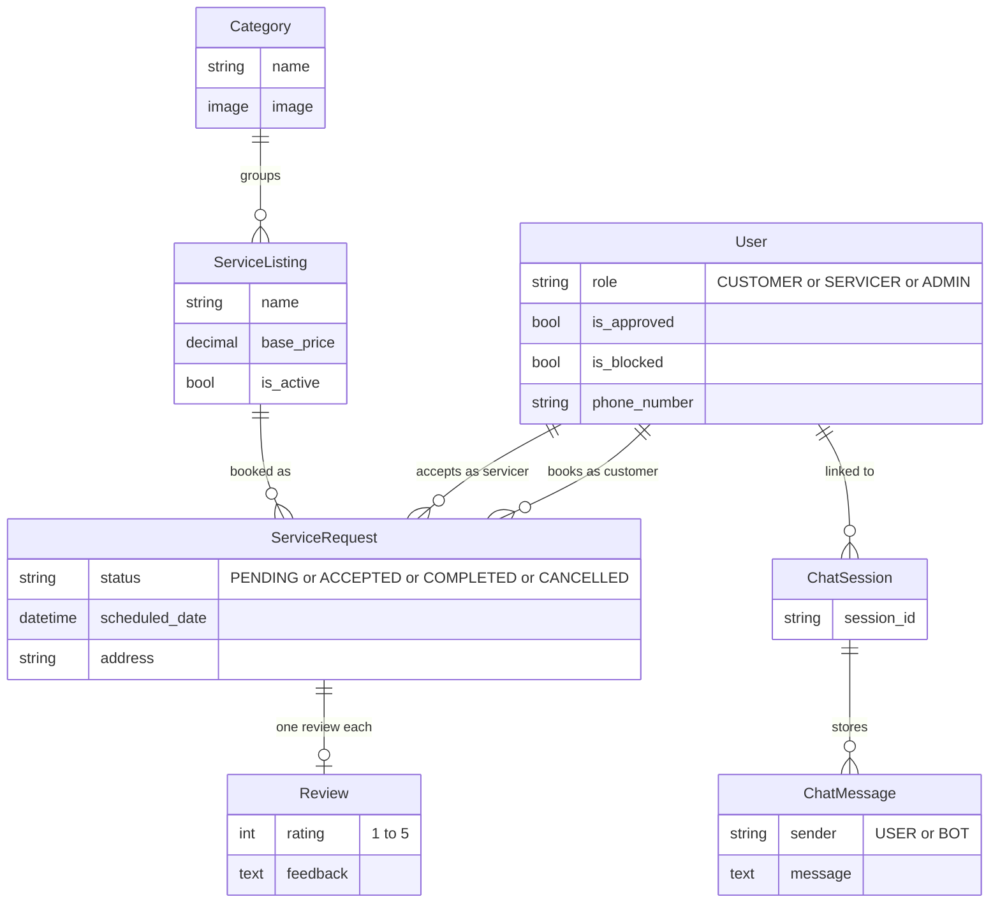
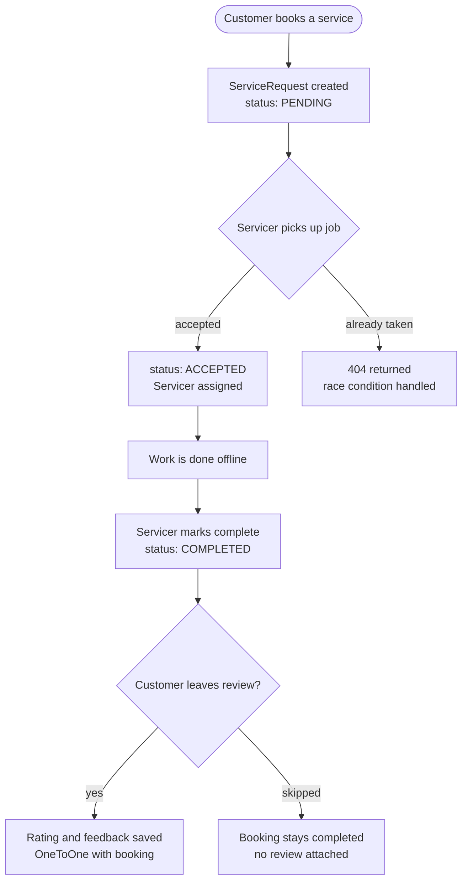
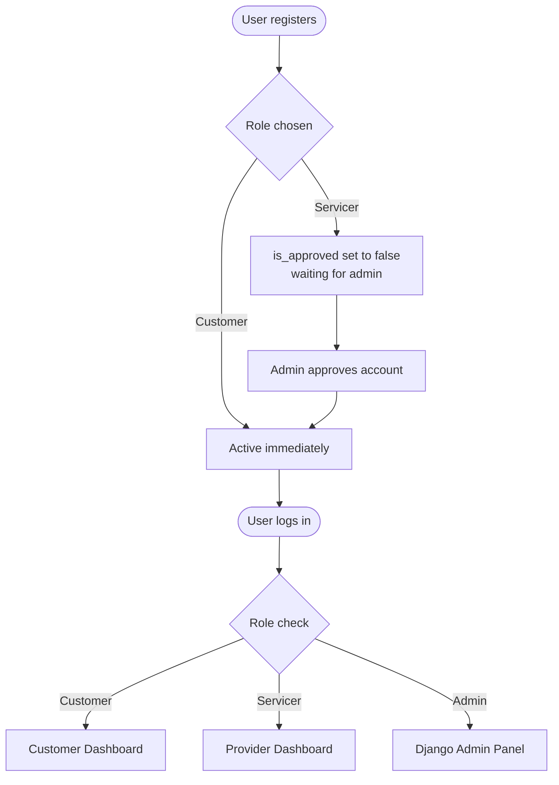
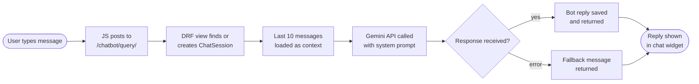
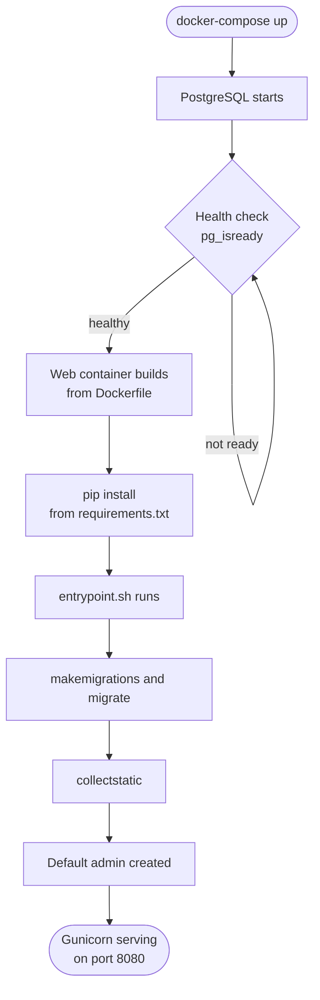

# CSE 3243 Web Programming Lab
## Mini Project Report

# TaskMates: On-Demand Home Services Booking Platform

---

**Submitted By**

| Name | Roll No | Registration No |
|------|---------|-----------------|
| Ayush Kumar  | 31      | 230962170       |
| Om Uday Dhondge  | 47      | 230962282       |
| Kushagra Gupta  | 46      | 230962280       |

**Section:** C

Under the Guidance of: Mrs. Suma D

**School of Computer Engineering**
Manipal Institute of Technology, Manipal, Karnataka - 576104

**2025-26**

---

## Acknowledgement

We thank our faculty guides for their guidance throughout this project. Their feedback on web architecture and database design shaped many of our decisions. We are also grateful to MIT Manipal for the lab infrastructure, and to the open-source communities behind Django, Bootstrap, and the Google Gemini API.

---

## Abstract

TaskMates is a full-stack web application that connects customers needing home services with approved service providers through a structured booking workflow. Built on Django 5.0 with Bootstrap 5 on the frontend, it implements role-based access for three user types: Customer, Service Provider, and Administrator. A standout feature is a Gemini 2.5-powered AI chatbot for real-time service discovery and booking assistance. The app is containerized with Docker and PostgreSQL, deployed via Gunicorn and WhiteNoise.

---

## Table of Contents

1. [Introduction](#1-introduction)
2. [Literature Review](#2-literature-review)
3. [Problem Statement](#3-problem-statement)
4. [Proposed Work](#4-proposed-work)
5. [Methodology and Technology Stack](#5-methodology-and-technology-stack)
6. [System Architecture](#6-system-architecture)
7. [Implementation Details](#7-implementation-details)
8. [User Experience and Interface Design](#8-user-experience-and-interface-design)
9. [Testing and Validation](#9-testing-and-validation)
10. [Screenshots and Output](#10-screenshots-and-output)
11. [Results and Discussion](#11-results-and-discussion)
12. [Future Work](#12-future-work)
13. [Conclusion](#13-conclusion)
14. [References](#14-references)

---

## 1. Introduction

### 1.1 Background

Finding reliable home service professionals is frustrating for customers, and finding steady work is equally hard for skilled providers. This project bridges that gap with a web platform where customers can browse, book, and track home services, while providers manage their jobs through a dedicated dashboard.

### 1.2 Objectives

1. Build a functioning marketplace with a complete booking lifecycle (Pending to Accepted to Completed)
2. Enforce role-based access so each user type only sees and does what they should
3. Give admins real analytics, not just raw database tables
4. Integrate a conversational AI assistant for service discovery and booking guidance
5. Package the app for reliable deployment using Docker and PostgreSQL

### 1.3 Scope

TaskMates is a proof-of-concept for a local services marketplace. With additions like payment processing and provider verification, it could serve a real community. The focus here is on getting the core workflow right.

---

## 2. Literature Review

### 2.1 Web Development Landscape

Django was chosen for its batteries-included approach: ORM, admin panel, auth, and CSRF protection out of the box. Bootstrap 5 handles responsive UI without heavy custom CSS. The Google Gemini API enables intelligent, free-form chat without needing a rule-based decision tree.

### 2.2 Related Platforms

Platforms like Urban Company and TaskRabbit validate the on-demand services model. We studied their user flows and implemented a simplified but complete version of role separation, job lifecycle management, and a service catalog.

**Gaps we addressed that most student projects skip:**
- Status-driven workflows beyond basic CRUD
- AI-based user assistance
- Containerized deployment, not just localhost

---

## 3. Problem Statement

Design and build a full-stack home services marketplace that:

1. Supports three roles (Customer, Service Provider, Administrator) with distinct dashboards
2. Lets customers browse, book, and track service requests
3. Lets providers view, accept, and complete jobs
4. Gives admins analytics on platform activity with chart visualizations
5. Includes an AI chatbot for service discovery and navigation
6. Runs in Docker with PostgreSQL as the database

---

## 4. Proposed Work

A Django monolith split into five apps, each owning a specific domain:

| Django App | Responsibility |
|------------|---------------|
| `users` | Custom user model, roles, registration, login |
| `services` | Service catalog: Categories and ServiceListings |
| `customers` | Customer dashboard, booking creation, reviews |
| `servicers` | Provider dashboard, job acceptance, job completion |
| `chatbot` | Gemini-powered AI chatbot with session history |

**Supporting tools:** Bootstrap 5 for UI, jQuery for AJAX chatbot calls, Chart.js for admin analytics, PostgreSQL for data, Docker for deployment, Gunicorn as the WSGI server, WhiteNoise for static files.

---

## 5. Methodology and Technology Stack

### 5.1 Development Approach

Iterative development: data models and admin config first, then user-facing views and templates, then the chatbot and deployment setup. Git was used for version control throughout.

### 5.2 Technology Stack

| Layer | Technology | Version | Purpose |
|-------|-----------|---------|---------|
| Language | Python | 3.11 | Backend |
| Framework | Django | 5.0.3 | Routing, ORM, auth, templating |
| REST API | Django REST Framework | 3.15.1 | Chatbot endpoint |
| Database | PostgreSQL | 15 | Primary database |
| Frontend CSS | Bootstrap | 5.3.0 | Responsive UI |
| JavaScript | jQuery | 3.6.0 | AJAX chatbot calls |
| Charts | Chart.js | Latest | Admin analytics |
| AI | Google Gemini API | 2.5 Flash Lite | Chatbot |
| Static Files | WhiteNoise | 6.6.0 | Production static serving |
| WSGI Server | Gunicorn | 21.2.0 | Production HTTP server |
| Containers | Docker + Compose | - | Deployment |

### 5.3 Why These Choices

Django over Flask: built-in admin, ORM, and migrations made schema evolution painless across multiple related models. PostgreSQL over SQLite: better for concurrent access in a Dockerized environment. Gemini 2.5 Flash Lite: good balance of speed, quality, and cost for a chatbot use case.

---

## 6. System Architecture

### 6.1 Project Structure

```
taskmates/
├── taskmates/          # Project config, root URLs, analytics API
├── users/              # Auth, custom User model
├── services/           # Service catalog
├── customers/          # Booking and review logic
├── servicers/          # Provider job management
├── chatbot/            # Gemini AI chat endpoint
├── templates/          # Shared templates (base.html, landing.html)
├── static/             # CSS, JS, images
├── Dockerfile
├── docker-compose.yml
├── entrypoint.sh       # Automated startup script
└── requirements.txt
```

### 6.2 Data Model



### 6.3 URL Routing

| URL Prefix | App | Key Endpoints |
|-----------|-----|--------------|
| `/` | taskmates | Landing page |
| `/admin/` | Django Admin | Analytics dashboard |
| `/users/` | users | `/login/`, `/register/`, `/logout/` |
| `/customers/` | customers | `/dashboard/`, `/book/<id>/`, `/review/<id>/` |
| `/servicers/` | servicers | `/dashboard/`, `/job/<id>/accept/`, `/job/<id>/complete/` |
| `/chatbot/` | chatbot | `/query/` REST endpoint |

### 6.4 Booking Lifecycle



### 6.5 Registration and Role Routing



### 6.6 AI Chatbot Flow



### 6.7 Deployment Boot Sequence



---

## 7. Implementation Details

### 7.1 Custom User Model

Extended `AbstractUser` with three additions: a `role` field (CUSTOMER, SERVICER, ADMIN), `is_approved` for servicer gating, and `is_blocked` for admin moderation.

```python
class User(AbstractUser):
    role = models.CharField(max_length=10, choices=ROLE_CHOICES, default='CUSTOMER')
    is_approved = models.BooleanField(default=False)
    is_blocked = models.BooleanField(default=False)
    phone_number = models.CharField(max_length=15, blank=True, null=True)
```

This was set up at the start of the project. Swapping in a custom user model after migrations are run is a known Django pain point.

### 7.2 Booking Lifecycle

`ServiceRequest` is the central model. Key behaviors:

- **Booking:** creates a request with `status=PENDING` and `servicer=null`
- **Acceptance:** `get_object_or_404(ServiceRequest, id=job_id, status='PENDING')` acts as an optimistic lock. A second servicer trying to accept gets a 404.
- **Completion:** view additionally checks `servicer=request.user` so only the assigned provider can mark it done.

### 7.3 AI Chatbot

Three layers working together:

- **Frontend (chatbot.js):** stores a `session_id` in `localStorage`, sends POST requests to `/chatbot/query/`, shows a typing animation while waiting
- **API layer:** DRF `APIView` with `AllowAny` permission handles both logged-in and anonymous users, manages session creation and message storage
- **AI service (gemini_service.py):** loads the last 10 messages as conversation context, formats them as `types.Content` objects, and calls Gemini with a 130-line system prompt that scopes the bot to TaskMates services and pricing only

### 7.4 Admin Analytics

Enhanced the default Django admin with:

1. A custom `base_site.html` that injects Chart.js on the admin home page
2. A `/admin-analytics/` endpoint protected by `@staff_member_required` returning booking status counts, bookings per service, and user role distribution
3. Three interactive charts rendered on page load: doughnut, bar, and pie
4. A CSV export action on the `ServiceRequest` admin for reporting

---

## 8. User Experience and Interface Design

### 8.1 Design Approach

Bootstrap 5 with a consistent primary color of `#4e73df`. Card-based layouts with rounded corners and shadows throughout. The Inter font is used for readability.

### 8.2 Key Screens

| Screen | What it shows |
|--------|-------------|
| Landing Page | Hero section with role-aware CTA buttons, service category cards |
| Customer Dashboard | Booking history table with color-coded status badges, service grid with Book Now modals |
| Servicer Dashboard | Assigned jobs list (left) and open jobs scanner (right) |
| Admin Dashboard | Django admin with Chart.js analytics overlay |
| Chatbot Widget | Fixed floating button, expands to chat popup with typing animation |

### 8.3 Role-Aware Navigation

The navbar and landing page adapt to who is logged in. A customer sees "Go to Dashboard," a servicer sees "Provider Dashboard," and an admin sees "Admin Panel." Anonymous users see Login and Register buttons. All of this is handled with Django template tags.

---

## 9. Testing and Validation

### 9.1 Testing Approach

Given the project scope, testing was manual and focused on two areas: functional workflows and access control.

**Functional testing covered:**
- Full booking lifecycle: Pending to Accepted to Completed to Reviewed
- Chatbot responses for service queries, pricing, off-topic questions
- Admin analytics chart data accuracy
- CSV export from admin panel

**Access control testing covered:**
- Unauthenticated access redirects to login
- Servicers cannot complete jobs assigned to others
- Analytics API is blocked for non-staff users

**Deployment testing covered:**
- Clean `docker-compose up --build` from scratch
- PostgreSQL health check preventing premature startup
- WhiteNoise serving static files with `DEBUG=False`

### 9.2 Issues and Fixes

| Issue | Fix |
|-------|-----|
| CSRF errors on chatbot first visit | `@csrf_exempt` on the view with `AllowAny` permissions |
| Two servicers accepting the same job | `get_object_or_404` with `status='PENDING'` acts as an optimistic lock |
| Web container starting before database was ready | `pg_isready` health check with `condition: service_healthy` in Compose |
| Static files not loading in production | WhiteNoise middleware with `collectstatic` in entrypoint |

---

## 10. Screenshots and Output

*(Insert screenshots of the following pages)*

1. Landing Page with hero section and service cards
2. Registration page with role selection
3. Login page
4. Customer Dashboard showing booking history and service catalog
5. Booking modal with datetime picker and address field
6. Servicer Dashboard showing assigned and open jobs
7. Admin Dashboard with Chart.js analytics (status doughnut, service bar, role pie)
8. Chatbot widget with a multi-turn conversation
9. Review modal with rating and feedback form

---

## 11. Results and Discussion

### 11.1 Objectives Met

| Objective | Status |
|-----------|--------|
| Three-role user system | Achieved |
| Full booking lifecycle | Achieved |
| Provider job management with access control | Achieved |
| Admin analytics with Chart.js | Achieved |
| Gemini AI chatbot with session memory | Achieved |
| Docker deployment with PostgreSQL | Achieved |

### 11.2 Strengths

- **Modular design:** each Django app has clear boundaries and no cross-app dependencies
- **One-command deployment:** `docker-compose up --build` gives a fully running app with demo data and admin access
- **Scoped chatbot:** system prompt engineering keeps Gemini on-topic and accurate for pricing queries
- **Data integrity:** foreign keys, `CASCADE`/`SET_NULL` delete behaviors, and `OneToOneField` on Review enforce consistency at the database level

### 11.3 Limitations

- No payment processing: bookings complete but nothing is charged
- No real-time notifications: providers refresh manually to see new jobs
- No automated test suite: all testing was done manually
- Single-instance deployment: not designed for horizontal scaling

---

## 12. Future Work

| Feature | What it adds |
|---------|-------------|
| Payment gateway (Razorpay or Stripe) | End-to-end transaction support |
| Django Channels WebSockets | Real-time job and status notifications |
| Provider profiles and ratings | Helps customers compare and choose providers |
| Location-based filtering | Shows nearby providers and local jobs |
| Email/SMS notifications | Booking confirmations via Django email backend and Twilio |
| Redis for session and catalog caching | Faster chatbot context retrieval and catalog queries |

---

## 13. Conclusion

TaskMates shows that a functional on-demand services marketplace can be built with a focused set of open-source tools. The project delivers role-based access control, a complete booking lifecycle, an AI chatbot that stays on topic, and a deployment pipeline that works out of the box. Beyond the coursework basics, it gave us hands-on experience with containerized deployments, REST API design, and prompt engineering. The foundation is solid and could realistically evolve into a production-grade product with payments, real-time updates, and automated testing added on top.

---

## 14. References

1. Django Software Foundation, "Django Documentation (v5.0)," 2024. Available: https://docs.djangoproject.com/en/5.0/
2. T. Christie, "Django REST Framework Documentation," 2024. Available: https://www.django-rest-framework.org/
3. Google, "Gemini API Documentation," 2024. Available: https://ai.google.dev/docs
4. Docker Inc., "Docker Compose Documentation," 2024. Available: https://docs.docker.com/compose/
5. Urban Company, https://www.urbancompany.com
6. TaskRabbit, https://www.taskrabbit.com
